  

&nbsp;&nbsp;

&nbsp;&nbsp;

&nbsp;&nbsp;

 

🚀 <strong>Portfolio:</strong>
<a href="https://app.netlify.com/teams/shraddhayewale/projects" target="_blank">
https://shraddhayewale.netlify.app
</a>

 

<table style="width: 100%; table-layout: fixed;">
<tr>
<td width="50%" valign="top" style="padding: 10px;">

### 🎓 Education & Focus

**B.Tech – Computer Science & Engineering**

- 💡 Focused on full-stack development
- 🧠 Strong fundamentals in backend logic & databases
- 🛠️ Interested in real-world, production-style projects

</td>

<td width="50%" valign="top" style="padding: 10px;">

### ⭐ Key Highlights

> *I build applications that are practical, structured, and user-focused.*

- ✅ Real-world project experience  
- ⚙️ Backend + Frontend integration  
- 📊 Data-driven systems  
- 🔄 Quick learner & team player  

</td>
</tr>
</table>

---

## 🛠️ Tech Arsenal

### 🌐 Frontend Development

 

          

          

### ⚙️ Backend & Database

 
 

 

### 🧰 Tools

          

---

## 🌐 Portfolio & Live Projects

### 🔐 Password Manager
Secure password management web application  
🌍 Live: https://passwordguardsecure.netlify.app  
📁 Repo: https://github.com/ShraddhaYewale/Password-Manager  

### 👩‍👩‍👧‍👧 Mahila Bachatgat Automation System
Enterprise-style financial & product management system  
**Tech:** ASP.NET, C#, SQL Server, Crystal Reports  

---

### 📫 Let’s Connect

I’m open to **internships, fresher roles, and collaborative projects**.

📧 Email: shraddhaky1007@gmail.com      
🌐 Portfolio:https://app.netlify.com/teams/shraddhayewale/projects        
🐙 GitHub: https://github.com/ShraddhaYewale  

✨ *Clean code. Real projects. Continuous growth.* ✨  

